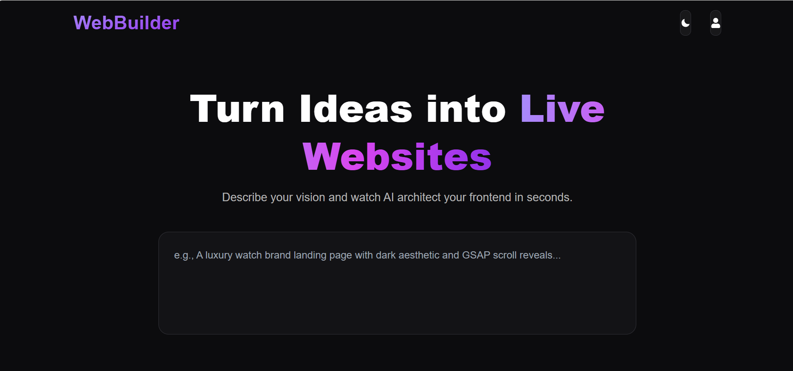
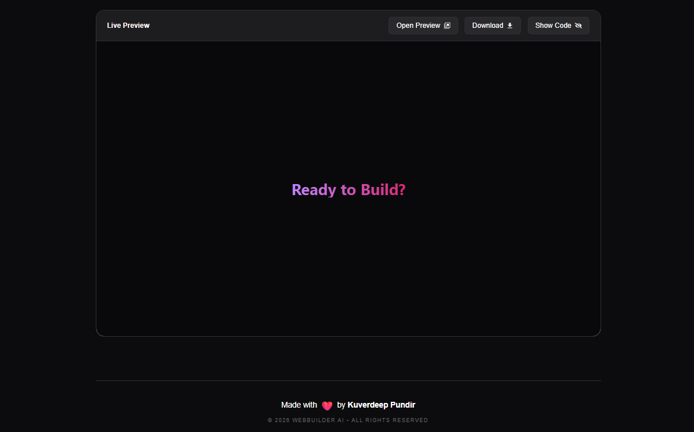

# 🌌 AetherCode AI

<div align="center">
  
  
  
  
  
</div>

---

### 🌐 [Live Demo Link](https://aethercodeai.netlify.app/)

**AetherCode AI** is a high-performance generative UI platform that transforms natural language prompts into production-ready **Tailwind CSS** and **GSAP** interfaces. Designed for rapid prototyping, it allows developers to architect complex frontends in seconds using a sophisticated "Output Console" workspace.

## 🖼️ Preview

<div align="center">
  
  
</div>

---

## 🚀 Key Features

* **AI Architecture**: Leverages **GPT-4o** to generate semantic HTML5 and modern utility-first styling.
* **Integrated Output Console**: A unified workspace featuring a live `iframe` preview side-by-side with a code editor.
* **Monaco Editor Integration**: Real-time code editing capabilities with syntax highlighting and auto-formatting.
* **Responsive Suite**: Built-in viewport switching to test designs instantly on **Mobile, Tablet, and Desktop**.
* **Smooth Animations**: Automatically injects **GSAP** (GreenSock) logic for high-end scroll and entrance animations.
* **One-Click Export**: Instant download of standalone, production-ready HTML files.

## 💻 Tech Stack & Knowledge Used

* **Frontend Library**: React (Vite)
* **AI Engine**: OpenAI SDK (v4+)
* **Animations**: GSAP (GreenSock Animation Platform)
* **Code Editor**: @monaco-editor/react
* **Styling**: Tailwind CSS (PostCSS)
* **Deployment**: Netlify / Vercel (Continuous Deployment)

## 🛡️ Authorization & Security

To protect sensitive information, this project implements:
* **Environment-based Management**: API keys are managed via separate helper files or `.env` variables to prevent exposure.
* **Git Protection**: A strictly configured `.gitignore` ensures that private configuration files (like `.env`) are never pushed to public repositories.

## 🛠️ Installation

1.  **Clone the repo:**
    ```bash
    git clone (https://github.com/ishurana001/AetherCode-AI.git)
    ```
2.  **Install dependencies:**
    ```bash
    npm install
    ```
3.  **Configure API Key:**
    ```
    VITE_OPENAI_API_KEY = "YOUR_OPENAI_API_KEY_HERE";
    ```
4.  **Run locally:**
    ```bash
    npm run dev
    ```

---
